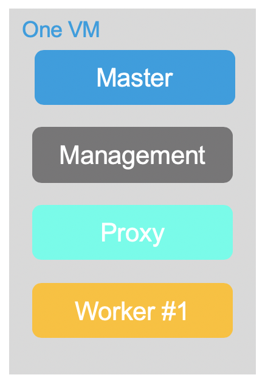
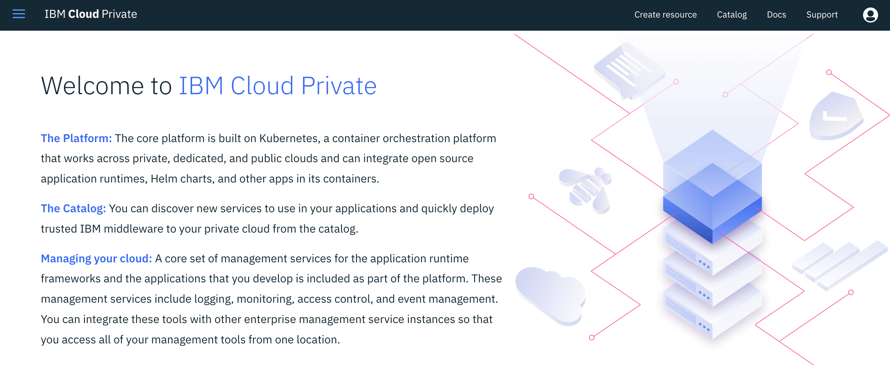
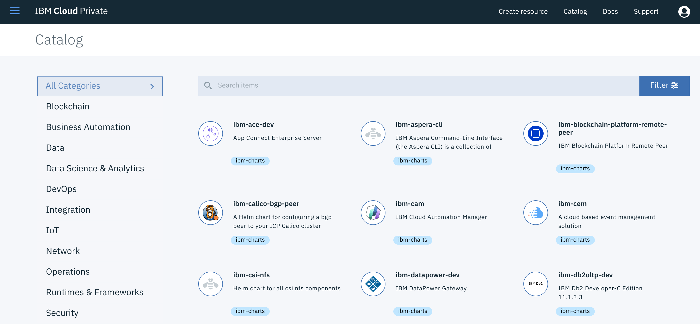
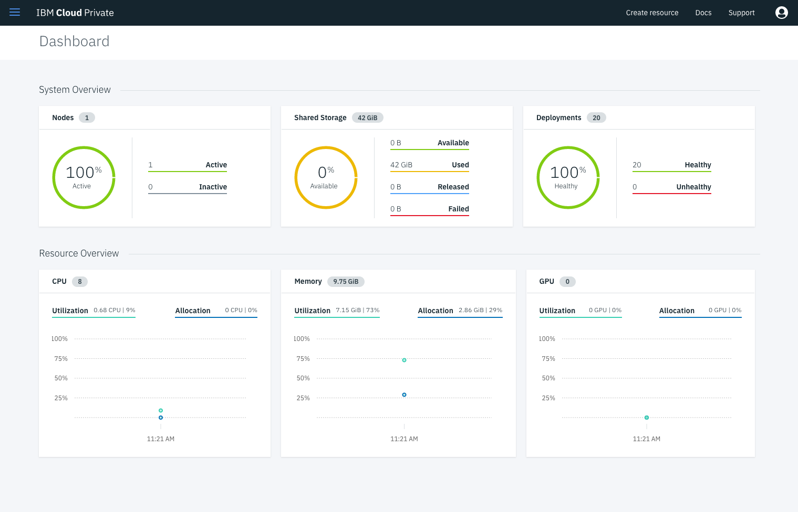
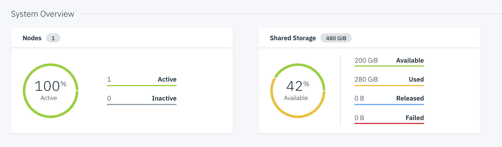
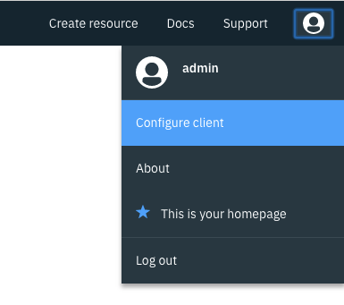
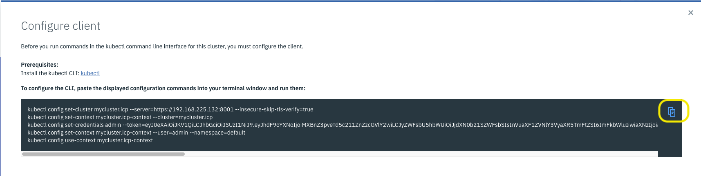

---
# Single Node Installation - IBM Cloud Private
---


# 1. IBM Cloud Private Overview

**IBM Cloud Private** is a private cloud platform for developing and running workloads locally. It is an integrated environment that enables you to design, develop, deploy and manage on-premises, containerized cloud applications behind your firewall. It includes the container orchestrator Kubernetes, a private image repository, a management console and monitoring frameworks.

### What is a private Cloud ?

 Private cloud is a cloud-computing model run solely for one organization. It can be managed internally or by third party, and can be hosted behind the company firewall or externally. Private cloud offers the benefits of a public cloud, including rapid deployment and scalability plus ease of use and elasticity, but also provides greater control, increased performance, predictable costs, tighter security and flexible management options. Customize it to your unique needs and security requirements.

### Terminology

- **master node** :  
    - controls and manages the cluster
    - **Kubectl**:  command line client
    - REST API:  used for communicating with the workers
    - Scheduling and replication logic
    - Generally 3 or more master nodes for resiliency
- **worker node**
    - is a worker machine in Kubernetes, previously known as a minion. A node may be a **VM** or **physical machine**, depending on the cluster. Each node has the services necessary to run pods and is managed by the master components.
    - **Kubelet**  agent that accepts commands from the master
    - **Kubeproxy**: network proxy service on a node level, responsible for routing activities for inbound or ingress traffic
    - Docker host
- **Containers**: Units of packaging
- **Pods**:
    - A collection of containers that run on a worker node
    - A pod can contain more than one service
    - Each pod has it’s own IP
    - A pod shares a PID namespace, network, and hostname
- **Replication Controller**
:
    - Ensures availability and scalability
    - Responsible for maintaining as many pods as requested by the user
    - Uses a template that describes specifically what each pod should contain
- **Labels**:

    - Metadata assigned to K8 resources – such as pods, services
    - Key-Value pairs for identification
    - Critical to K8s as it relies on querying the cluster for resources that have certain labels
- **Services:**
    - Collection of pods exposed as an endpoint
    - Information stored in the K8 cluster state and networking info propagated to all worker nodes
- **Secrets**:
    - Sensitive information that containers need to read or consume
    - Are special volumes mounted automatically so that the containers can read its contents
    - Each entry has it’s own path


### Architecture

See below a global picture showing ICP architecture and most common components.


This lab is going to focus on the couple "Docker & Kubernetes" which is the main foundation of IBM Cloud Private. In this lab, all nodes will be part of a single VM.

# 2. Objectives


In this first lab, you will prepare and install IBM Cloud Private (ICP) on a **single node** (host) running on a VM (this is a virtual Server in IBM Cloud).

You will learn how to:

- prepare your platform to support a single node ICP (i.e all nodes - master, worker, proxy, boot nodes will be concentrated in one node)
- configure the installation setup for ICP
- check and validate all the prerequisites
- install Docker and Hyperkube
- check all the components
- install different CLIs and other modifications to the cluster


# 3. Prerequisites

This lab needs some hardware and software prerequisites.

At least (minimal):
- [ ] one host (physical or virtual)
- [ ] CPU = 8 cores (or virtual cores)
- [ ] RAM = 32 GB
- [ ] Storage = 300 GB (depending on the other solutions that you install on top of ICP)
- [ ] Linux OS like Ubuntu 16.04 LTS 




If you need some more help, see the official documentation: [here](https://www.ibm.com/support/knowledgecenter/en/SSBS6K_3.1.2/kc_welcome_containers.html) or

https://www.ibm.com/support/knowledgecenter/en/SSBS6K_3.1.2/kc_welcome_containers.html

# 4. Install ICP on a Ubuntu VM

Be sure that you have already prepared a VMware VM or a virtual server containing an **Ubuntu** system up and running. Login to the Ubuntu system as **root** or sudo -i once connected.

> **ipaddress** is the ip address of the VM and subsequently the ip address of the different nodes in this lab.
>
> Use **putty** or **ssh** to get connected to the ubuntu VM.

Here are the steps:

### Task 1 : Configuring the system

Before updating the operating system, check the **/etc/hosts** file in Linux.

Use **putty** or **ssh** to connect to the VM.

`ssh root@ipaddress`

Results:

```
ssh root@158.176.128.124 
root@158.176.128.178's password: 
Welcome to Ubuntu 16.04.5 LTS (GNU/Linux 4.4.0-141-generic x86_64)

 * Documentation:  https://help.ubuntu.com
 * Management:     https://landscape.canonical.com
 * Support:        https://ubuntu.com/advantage

  Get cloud support with Ubuntu Advantage Cloud Guest:
    http://www.ubuntu.com/business/services/cloud

1 package can be updated.
1 update is a security update.

New release '18.04.2 LTS' available.
Run 'do-release-upgrade' to upgrade to it.


Last login: Fri May 17 12:33:15 2019 from 62.35.133.241
root@nicedsc01:~# 
```

Some **variables** have been set during the installation process. Execute the following command:

`echo $IPADDRESS`

Result (example)

```
# echo $IPADDRESS
158.176.128.178
```

Once connected, update your system with:

`apt -q update` or`apt -qq update` for a less verbose command.

Results:

```
# apt-get -q update
Hit:1 http://mirrors.service.networklayer.com/ubuntu xenial InRelease
Hit:2 http://mirrors.service.networklayer.com/ubuntu xenial-updates InRelease
Hit:3 http://mirrors.service.networklayer.com/ubuntu xenial-backports InRelease
Hit:4 http://mirrors.service.networklayer.com/ubuntu xenial-security InRelease
Reading package lists..
```


Check your (public) ip address by typing the command:

`curl ifconfig.co`

Results (example):
```console
# curl ifconfig.co
158.175.102.12
```

> This address should be same as the one used to ssh your VM.
> This will be referred as **$IPADDRESS** in the labs. 

Then, edit the hosts file with this command:

`nano /etc/hosts`

You should have the following lines already in the file:
```console
127.0.0.1       localhost
# The following lines are desirable for IPv6 capable hosts
::1     ip6-localhost   ip6-loopback
fe00::0 ip6-localnet
ff00::0 ip6-mcastprefix
ff02::1 ip6-allnodes
ff02::2 ip6-allrouters
ff02::3 ip6-allhosts
127.0.1.1       nicedsc01.ibm.ws        nicedsc01
```

> Note : you can see some IP v6 definitions - **don't touch them**
>
> **Don't change the hostnames**

Change the line (generally the last line) containing **127.0.1.1** with your **ipaddress**. 

So it looks like (as an example):

`158.176.128.178    nicedsc01.ibm.ws        nicedsc01   `

> **Very important : Don't touch or change the hostnames at this step or later on.**
>
> **Just change the ipaddress**

Your /etc/hosts file should look like that after the change (please don't touch the hostnames):

```console
127.0.0.1       localhost
# The following lines are desirable for IPv6 capable hosts
::1     ip6-localhost   ip6-loopback
fe00::0 ip6-localnet
ff00::0 ip6-mcastprefix
ff02::1 ip6-allnodes
ff02::2 ip6-allrouters
ff02::3 ip6-allhosts
158.176.128.178 nicedsc01.ibm.ws        nicedsc01
```

**Save** the file (ctrl O, enter, ctrl X ).

Use the following command to **update** the system with some complementary packages:

```console
apt -y install apt-transport-https ca-certificates curl software-properties-common python-minimal jq
```

Check carefully the output to see if you have errors and especially if you cannot connect.

```bash
...
Preparing to unpack .../curl_7.47.0-1ubuntu2.12_amd64.deb ...
Unpacking curl (7.47.0-1ubuntu2.12) over (7.47.0-1ubuntu2.11) ...
Preparing to unpack .../libcurl3-gnutls_7.47.0-1ubuntu2.12_amd64.deb ...
Unpacking libcurl3-gnutls:amd64 (7.47.0-1ubuntu2.12) over (7.47.0-1ubuntu2.11) ...
Preparing to unpack .../apt-transport-https_1.2.31_amd64.deb ...
Unpacking apt-transport-https (1.2.31) over (1.2.29ubuntu0.1) ...
Selecting previously unselected package libonig2:amd64.
Preparing to unpack .../libonig2_5.9.6-1ubuntu0.1_amd64.deb ...
Unpacking libonig2:amd64 (5.9.6-1ubuntu0.1) ...
Selecting previously unselected package jq.
Preparing to unpack .../jq_1.5+dfsg-1ubuntu0.1_amd64.deb ...
Unpacking jq (1.5+dfsg-1ubuntu0.1) ...
Processing triggers for man-db (2.7.5-1) ...
Processing triggers for libc-bin (2.23-0ubuntu10) ...
Setting up libpython2.7-stdlib:amd64 (2.7.12-1ubuntu0~16.04.4) ...
Setting up python2.7 (2.7.12-1ubuntu0~16.04.4) ...
Setting up libpython-stdlib:amd64 (2.7.12-1~16.04) ...
Setting up python (2.7.12-1~16.04) ...
Setting up libcurl3-gnutls:amd64 (7.47.0-1ubuntu2.12) ...
Setting up curl (7.47.0-1ubuntu2.12) ...
Setting up apt-transport-https (1.2.31) ...
Setting up libonig2:amd64 (5.9.6-1ubuntu0.1) ...
Setting up jq (1.5+dfsg-1ubuntu0.1) ...
Processing triggers for libc-bin (2.23-0ubuntu10) ...
```


Increase your virtual memory maximum by typing the command:

`sysctl -w vm.max_map_count=262144`

Results:

```bash
# sysctl -w vm.max_map_count=262144
vm.max_map_count = 262144
```

Then K8s won't run with swap enabled. swapoff -a is the Ubuntu command for disabling it.

`swapoff -a`


> IMPORTANT. The 2 previous commands only work when the system is online. If it is rebooted then these settings are lost and have to be re-run before k8s will start. 

These commands can be turned on permanently by typing:

```bash
sed -i '/ swap / s/^/#/' /etc/fstab
echo "vm.max_map_count=262144" >> /etc/sysctl.conf
```


### Task 2 : Add Docker’s official GPG key

Use the following command:

```console
curl -fsSL https://download.docker.com/linux/ubuntu/gpg | apt-key add -
```

Results:

```bash
# curl -fsSL https://download.docker.com/linux/ubuntu/gpg | apt-key add -
OK
```


### Task 3: Add a repo to get the Docker

Use the following 2 commands:

```bash
add-apt-repository "deb [arch=amd64] https://download.docker.com/linux/ubuntu $(lsb_release -cs) stable"
```

Then update the system:

`apt -q update`

Results:

```
# apt -q update
Get:1 https://download.docker.com/linux/ubuntu xenial InRelease [66.2 kB]
Get:2 https://download.docker.com/linux/ubuntu xenial/stable amd64 Packages [8,482 B]
Hit:3 http://mirrors.service.networklayer.com/ubuntu xenial InRelease
Hit:4 http://mirrors.service.networklayer.com/ubuntu xenial-updates InRelease
Hit:5 http://mirrors.service.networklayer.com/ubuntu xenial-backports InRelease
Hit:6 http://mirrors.service.networklayer.com/ubuntu xenial-security InRelease
Fetched 74.7 kB in 2s (36.7 kB/s)
Reading package lists...
Building dependency tree...
Reading state information...
83 packages can be upgraded. Run 'apt list --upgradable' to see them.
```

### Task 4: Get Docker

You can list all versions available in the added repo:

`apt-cache madison docker-ce`

Use the following command to get Docker installed (Docker version 18.03.1 is the maximum version supported by IBM Cloud Private 3.1.0):

`apt-get -y install docker-ce=18.03.1~ce-0~ubuntu`

Results:

```
...
Unpacking docker-ce (18.03.1~ce~3-0~ubuntu) ...
Processing triggers for man-db (2.7.5-1) ...
Processing triggers for libc-bin (2.23-0ubuntu10) ...
Processing triggers for ureadahead (0.100.0-19) ...
Processing triggers for systemd (229-4ubuntu21.15) ...
Setting up pigz (2.3.1-2) ...
Setting up aufs-tools (1:3.2+20130722-1.1ubuntu1) ...
Setting up cgroupfs-mount (1.2) ...
Setting up libltdl7:amd64 (2.4.6-0.1) ...
Setting up docker-ce (18.06.2~ce~3-0~ubuntu) ...
Processing triggers for libc-bin (2.23-0ubuntu10) ...
Processing triggers for systemd (229-4ubuntu21.15) ...
Processing triggers for ureadahead (0.100.0-19) ...
```

Check that Docker is running (client and server):

`docker version`

Results (as an example)

```
# docker version
Client:
 Version:           18.03.1-ce
 API version:       1.38
 Go version:        go1.10.3
 Git commit:        6d37f41
 Built:             Sun Feb 10 03:48:06 2019
 OS/Arch:           linux/amd64
 Experimental:      false

Server:
 Engine:
  Version:          18.03.1-ce
  API version:      1.38 (minimum version 1.12)
  Go version:       go1.10.3
  Git commit:       6d37f41
  Built:            Sun Feb 10 03:46:30 2019
  OS/Arch:          linux/amd64
  Experimental:     false
```


> Docker client is mainly the CLI. The server is composed of different programs and among then, there is the **containerd**, the engine managing the isolation/running of containers.

You can look around at the docker CLI (and go thru some of  the sub-commands) by just typing:

`docker`

`docker ps`

`docker images`

Another lab will go in detail to explain how Docker is managing the images and running them.


### Task 5: Download IBM Cloud Private

We are going to use Docker to download the ICP-ce (community edition) package from the **dockerHub** web site:

`docker pull ibmcom/icp-inception:3.1.2`

IBM has packaged all the main components necessary for the installation in one package (note that you can change the version to a more recent one if needed). The pull sub-command is going to download the image on the local file system (the image will be run to install ICP).

``` 
# docker pull ibmcom/icp-inception:3.1.2
3.1.2: Pulling from ibmcom/icp-inception
59265c40e257: Pull complete 
16efbc2ae218: Pull complete 
8b1524c7376b: Pull complete 
520dd30b49f0: Pull complete 
116b88da1d1d: Pull complete 
ff7e9c33dd41: Pull complete 
d6416bfef82b: Pull complete 
c5eafd6a15a8: Pull complete 
66bffe425fce: Pull complete 
c15d7399ecfa: Pull complete 
3f302a4eaa11: Pull complete 
ef9c3fb32d3a: Pull complete 
601b39965131: Pull complete 
cece4b7ec641: Pull complete 
293ff5615f4f: Pull complete 
fc83f060b606: Pull complete 
04730c107cc5: Pull complete 
Digest: sha256:b684cad95e82ee9df7371bbc8358f40f5f602d15e1e6925c779a674fec6c32db
Status: Downloaded newer image for ibmcom/icp-inception:3.1.2
```


Create a directory and move to that directory:

```
mkdir /opt/icp
cd /opt/icp
```

Copy the ICP package into that directory with this command:

```console
docker run -e LICENSE=accept -v "$(pwd)":/data ibmcom/icp-inception:3.1.2 cp -r cluster /data
```

> Note:  this docker command is executing the linux copy (cp) command from the volume (-v parameter). This will create a cluster directory in /opt/icp with all necessary files.

```
# ls -l
total 4
drwxr-xr-x 3 root root 4096 May 17 19:15 cluster
```


### Task 6: SSH Keys setup

We are going to generate new ssh keys to be used normally inside the cluster:

```
cd /opt/icp
ssh-keygen -b 4096 -f ~/.ssh/id_rsa -N ""
cat ~/.ssh/id_rsa.pub | sudo tee -a ~/.ssh/authorized_keys
systemctl restart sshd
cp ~/.ssh/id_rsa ./cluster/ssh_key
```

> Finally a new key (**ssh_key**) should now exist in the /opt/icp/cluster:

`ls /opt/icp/cluster`

Results:

```bash
# ls /opt/icp/cluster
cfc-certs  cfc-components  cfc-keys  config.yaml  hosts  logs  misc  ssh_key
```


### Task 7: Customize ICP

Add the IP address of each node in the cluster to the **/opt/icp/cluster/hosts ** file  (in our case, we use the same ip address for each component).

> Use the unique **ipaddress** that you have already used.

`nano /opt/icp/cluster/hosts`

Results:

```
#[master]
#1.1.1.1

#[worker]
#2.2.2.2
...
#2.2.2.9

#[proxy]
#3.3.3.3

#[management]
#4.4.4.4

#[va]
#5.5.5.5
```

Then uncomment all the lines (except va section) and type your ipaddress for each section (see below as an example) :

```bash
[master]
158.176.128.178

[worker]
158.176.128.178

[proxy]
158.176.128.178

[management]
158.176.128.178

#[va]
#5.5.5.5
```


The last 2 lines (concerning va - vulnerability advisor) will stay commented.

**Save** the file (ctrl O, enter, ctrl X ).

To understand the installation setup, you can look at the **/opt/icp/cluster/config.yaml** file where you will find all the parameters before the start of the installation.

`nano /opt/icp/cluster/config.yaml`

We are going to change the "config.yaml" file (**be carefull** this is a YAML file and you are not allowed to use TAB or any cyrillic characters) :

```
# Licensed Materials - Property of IBM
# IBM Cloud private
# @ Copyright IBM Corp. 2017 All Rights Reserved
# US Government Users Restricted Rights - Use, duplication or disclosure restricted by GSA ADP Schedule Contract with IBM Corp.

---

## Network Settings
network_type: calico
# network_helm_chart_path: < helm chart path >

## Network in IPv4 CIDR format
network_cidr: 10.1.0.0/16

## Kubernetes Settings
service_cluster_ip_range: 10.0.0.0/16

# cluster_domain: cluster.local
# cluster_name: mycluster
# cluster_CA_domain: "{{ cluster_name }}.icp"

...
```


You can have a look into that file (there is a lot of features that you can implement like GlusterFS or VMware network SDN or Minio Object Storage).

By default the admin password is not set. You can see this by searching in the config.yaml file:

`# default_admin_password:`

So **add those 3 lines at the end** of the config.yaml :

```
password_rules:
- '(.*)'
default_admin_password: admin1!
```

> Take a note of the admin password : **admin1!**

Save the file (Ctrl+o, Enter, Ctrl+x)

> ***hosts* and config.yaml** are the 2 most important files to parameter during the ICP installation. In a "standard configuration" with multiple worker nodes, you should specify a list of IP addresses under the worker section in the *hosts* file.

**You are now ready to install IBM Cloud Private**.


### Task 7: Install ICP

Finally install ICP by using those commands:

```console
cd /opt/icp/cluster
docker run -e LICENSE=accept --net=host -t -v "$(pwd)":/installer/cluster ibmcom/icp-inception:3.1.2 install
```

Installation should last around 20 minutes. Check messages.
In case of error (red messages), make the appropriate change in the configuration files. Sometimes the installation can slowdown a little bit with **Retrying** messages  (during IAM startup for instance).

The end of the installation should look like this :

```
PLAY [Uploading images and charts of archive addons] ***********************************************

TASK [kubectl-config : Checking if kube-config exist or not] ***************************************
changed: [158.176.128.178 -> localhost]

TASK [kubectl-config : include_tasks] **************************************************************
included: /installer/playbook/roles/kubectl-config/tasks/create-one.yaml for 158.176.128.178

TASK [kubectl-config : Configuring kubectl] ********************************************************
changed: [158.176.128.178 -> localhost]

TASK [k8s-resource : Finding all resource files] ***************************************************
ok: [158.176.128.178 -> localhost]

TASK [k8s-resource : Creating Kubernetes resources] ************************************************

TASK [archive-addon : include_tasks] ***************************************************************

PLAY RECAP *****************************************************************************************
158.176.128.178            : ok=196  changed=129  unreachable=0    failed=0   
localhost                  : ok=267  changed=168  unreachable=0    failed=0   


POST DEPLOY MESSAGE ********************************************************************************

The Dashboard URL: https://158.176.128.178:8443, please use credentials in config.yaml to login.

Playbook run took 0 days, 0 hours, 31 minutes, 45 seconds


```


> Note that during a simple installation, there are **no failures and no errors**. If some errors occur and the install exits then first retry the install command and follow the instructions. If it doesn't work then "uninstall" ICP, correct the issue and restart the install process.

**<u>In case of problem : you will be asked to uninstall</u>**: follow that process:

```console
docker run -e LICENSE=accept --net=host -t -v "$(pwd)":/installer/cluster ibmcom/icp-inception:3.1.2 uninstall
```

**BEFORE GOING TO THE NEXT STEP, WAIT a few MINUTES** so that everything can start gracefully.


Use the green link at the end of the installation script to get access to the console (admin/admin1!) in a browser:

`https://ipaddress:8443`  


You should receive the **Welcome Page**:



Click on the **Catalog** menu (top right) to look at the list of applications already installed:



The **Catalog** shows Charts that you can visit (it could take au few seconds to refresh the first time)

You can look at the (helm) catalog and visit some entries (but don't create any application at the moment).

### Task 8: Install and configure CLIs

At this point, you will need to use the **Kubernetes CLI** (command kubectl).  
For that purpose, open a ssh terminal with the Ubuntu VM in root mode.

Use the following command to execute **kubectl**:

`kubectl`

Results:

```console
# kubectl
kubectl controls the Kubernetes cluster manager. 

Find more information at: https://kubernetes.io/docs/reference/kubectl/overview/

Basic Commands (Beginner):
  create         Create a resource from a file or from stdin.
  expose         Take a replication controller, service, deployment or pod and expose it as a new Kubernetes Service
  run            Run a particular image on the cluster
  set            Set specific features on objects

...
```

We now need to **configure** kubectl to get access to the cluster. An alternative method can be used (see the Appendix A : How to get connected to the cluster) if you are interested.

We are going to create a **script** to help us to connect to our cluster.
Type the following commands :

`cd`

`nano connect2icp.sh`

Copy the following code :

```console
CLUSTERNAME=mycluster
ACCESS_IP=`curl ifconfig.co`
USERNAME=admin
PASSWD=admin1!

token=$(curl -s -k -H "Content-Type: application/x-www-form-urlencoded;charset=UTF-8" -d "grant_type=password&username=$USERNAME&password=$PASSWD&scope=openid" https://$ACCESS_IP:8443/idprovider/v1/auth/identitytoken --insecure | jq .id_token | awk  -F '"' '{print $2}')

kubectl config set-cluster $CLUSTERNAME.icp --server=https://$ACCESS_IP:8001 --insecure-skip-tls-verify=true
kubectl config set-context $CLUSTERNAME.icp-context --cluster=$CLUSTERNAME.icp
kubectl config set-credentials admin --token=$token
kubectl config set-context $CLUSTERNAME.icp-context --user=admin --namespace=default
kubectl config use-context $CLUSTERNAME.icp-context
```

Save the file (ctrl O, enter, ctrl X ) and make this file executable :

`chmod +x connect2icp.sh`

> These lines in that script are getting a token automatically for you. But every 12 hours, the token expires and you will need to type that script (connect2icp.sh) again. 

Then execute that shell program :

`~/connect2icp.sh`

Results :

```console
# ~/connect2icp.sh
Cluster "cluster.local" set.
Context "cluster.local-context" modified.
User "admin" set.
Context "cluster.local-context" modified.
Switched to context "cluster.local-context".
```


As a result, you will see that you are now **connected** for **12 hours** to the cluster.

`kubectl version --short`

Results :

```console
# kubectl version --short
Client Version: v1.12.3
Server Version: v1.12.3+icp
```

Try this command to show all the worker nodes :

`kubectl get nodes`

Results :

```console
# kubectl get nodes
NAME            STATUS    ROLES     AGE       VERSION
169.50.200.70   Ready     etcd,management,master,proxy,worker   35m       v1.12.3+icp
```

> After a long period of inactivity, if you see some connection error when typing a kubectl command then re-execute the `~/connect2icp.sh` command.

To get help from the kubectl, just type this command:

`kubectl`

Finally, you are using the  **cloudctl** command. This command can be used to configure and manage IBM Cloud Private resources (like nodes, access, security, catalog, cluster ...) 

Execute the **cloudctl** command for the first time 

`cloudctl version`

Results:
```console 
# cloudctl version
Client Version: 3.1.2-1203+81b254e18da556ae1d9b683a9702e8420896dae9
Server Version: 3.1.2-1203+81b254e18da556ae1d9b683a9702e8420896dae9
```


Before using the **cloudctl** with the master, you must login to the master:

```
cloudctl login -a https://mycluster.icp:8443 --skip-ssl-validation -u admin -p admin1! -n default
```

Results:

```console
# cloudctl login -a https://mycluster.icp:8443 --skip-ssl-validation -u admin -p admin1! -n default
Authenticating...
OK

Targeted account mycluster Account (id-mycluster-account)

Targeted namespace default

Configuring kubectl ...
Property "clusters.mycluster" unset.
Property "users.mycluster-user" unset.
Property "contexts.mycluster-context" unset.
Cluster "mycluster" set.
User "mycluster-user" set.
Context "mycluster-context" created.
Switched to context "mycluster-context".
OK

Configuring helm: /root/.helm
OK
```

With that **cloudctl cm** command, you can manage the **infrastructure** part of the cluster like adding new worker nodes (machine-type-add, worker-add) and so on.

Then you can type some commands concerning your cluster:

`cloudctl cm masters mycluster`

Results
```console
# cloudctl cm masters mycluster
ID             Private IP      Machine Type   State   
mycluster-m1   169.50.200.70   -              deployed 
```

Among all sub-commands in **cloudctl**, there are some commands to manage the infrastructure components like :
- cluster
- workers (adding, removing ...)
- registry (docker image management )
- helm repositories and catalog management


### Task 9: Adding persistent storage to Kubernetes

Go to the ICP management console and click on the menu (top left hand side).
Select **Dashboard** in the menu.




Normally after the installation, all internal storage is used by ICP (so that's why we see 0 % available in the storage metric).
We are now going to add some persistent storage.

> The type of storage -Hostpath- is considering the node storage to be used. In production, hostpath will not be used because if the node where the storage is located craches, then you loose all your data. 

In the terminal, use the following commands:

```
cd /var
mkdir data01
```

Open a file with that command:

`nano pv-rwo.yaml`

Copy and paste the following text in the file (this is a kubernetes document):

```console
apiVersion: v1
kind: PersistentVolume
metadata:
  name: hostpath-pv-once-test1
spec:
  accessModes:
  - ReadWriteOnce
  capacity:
    storage: 100Gi
  hostPath:
    path: /var/data01
  persistentVolumeReclaimPolicy: Recycle
```
Save the file (ctrl O, enter, ctrl X ).

With that document, we are telling Kubernetes to create a persistent storage of 20GB with **read/write once** mode in the host path /var/data01.

To create this persistent volume, just type the following command:

`kubectl create  -f ./pv-rwo.yaml`

Results:

```
# kubectl create  -f ./pv-rwo.yaml
persistentvolume/hostpath-pv-once-test1 created
```


Now create a 100GB persistent storage volume with read/write/many mode:

`nano pv-rwm.yaml`

Copy and paste the following text in the file (this is a kubernetes document):

```console
apiVersion: v1
kind: PersistentVolume
metadata:
  name: hostpath-pv-many-test1
spec:
  accessModes:
  - ReadWriteMany
  capacity:
    storage: 100Gi
  hostPath:
    path: /var/data01
  persistentVolumeReclaimPolicy: Recycle
```
Save the file (ctrl O, enter, ctrl X ).
And then use the following command:

`kubectl create  -f ./pv-rwm.yaml`

Once created these 2 volumes (hostpath) should be listed with the following command:

`kubectl get pv`

> Note: the 2 volumes are shown as available storage.

Now go back to the **Dashboard** to see the change:




### Task 10. Installing helm

Helm is a client/server application : Helm client and Tiller server.
Execute the following commands to install Helm client on the Master:

```console
cd
curl -O https://storage.googleapis.com/kubernetes-helm/helm-v2.9.1-linux-amd64.tar.gz
tar -vxhf helm-v2.9.1-linux-amd64.tar.gz
export PATH=/root/linux-amd64:$PATH
export HELM_HOME=/root/.helm
```

You should Initialize Helm

`helm init --client-only`

Results:
```console
# helm init --client-only
Creating /root/.helm/repository
Creating /root/.helm/repository/cache
Creating /root/.helm/repository/local
Creating /root/.helm/plugins
Creating /root/.helm/starters
Creating /root/.helm/cache/archive
Creating /root/.helm/repository/repositories.yaml
Adding stable repo with URL: https://kubernetes-charts.storage.googleapis.com
Adding local repo with URL: http://127.0.0.1:8879/charts
$HELM_HOME has been configured at /root/.helm.
Not installing Tiller due to 'client-only' flag having been set
Happy Helming!

```

After you have initialize helm client. Try the following command to see the version:

`helm version --tls`


Results:
```console 
# helm version --tls
Client: &version.Version{SemVer:"v2.9.1", GitCommit:"20adb27c7c5868466912eebdf6664e7390ebe710", GitTreeState:"clean"}
Server: &version.Version{SemVer:"v2.9.1+icp", GitCommit:"843201eceab24e7102ebb87cb00d82bc973d84a7", GitTreeState:"clean"}

```
> The helm Client and server should be the same version (i.e. **version 2.9.1**)
> If you get some X509 error the also type that command: `cp ~/.kube/mycluster/*.pem ~/.helm/`

Another important step is to access to the ICP container registry.

To do so,  login to the private registry:

`docker login mycluster.icp:8500 -u admin -p admin1!`

Results:
```console
# docker login mycluster.icp:8500 -u admin -p admin1!
WARNING! Using --password via the CLI is insecure. Use --password-stdin.
Login Succeeded
```

### Task 11. Last important step before starting the labs

One other point, we noticed during the labs is the **number of pods per core** limited to 10.

To solve that issue, follow the instructions otherwise you will get a message saying 

`insufficient pods0/1` during launch of a new deployment in Kubernetes.

First copy a config file example to anther place:

`cp /etc/cfc/kubelet/kubelet-service-config ./kubelet-dynamic-config`

Edit the ./kubelet-dynamic-config file

`nano ./kubelet-dynamic-config` 

Find the **podsPerCore** parameter (should be 10) and change it to **80** as shown below :

```
kind: KubeletConfiguration
apiVersion: kubelet.config.k8s.io/v1beta1
staticPodPath: "/etc/cfc/pods"
rotateCertificates: true
authentication:
  x509:
    clientCAFile: "/etc/cfc/kubelet/ca.crt"
  webhook:
    enabled: true
  anonymous:
    enabled: false
authorization:
  mode: AlwaysAllow
clusterDomain: "cluster.local"
clusterDNS:
  - "10.0.0.10"
cgroupDriver: "cgroupfs"
featureGates:
  ExperimentalCriticalPodAnnotation: true
readOnlyPort: 0
protectKernelDefaults: true
maxPods: 1000
podsPerCore: 80
failSwapOn: false
streamingConnectionIdleTimeout: "4h0m0s"
eventRecordQPS: 0
```

Save the file (ctrl+o, enter, ctrl+x).

Create the ConfigMap by pushing the configuration file to the control plane:

```
kubectl -n kube-system create configmap my-node-config --from-file=kubelet=kubelet-dynamic-config --append-hash -o yaml
```

Results:

```
apiVersion: v1
data:
  kubelet: |
    {...}
kind: ConfigMap
metadata:
  creationTimestamp: 2017-09-14T20:23:33Z
  name: my-node-config-gkt4c2m4b2
  namespace: kube-system
  resourceVersion: "119980"
  selfLink: /api/v1/namespaces/kube-system/configmaps/my-node-config-gkt4c2m4b2
  uid: 946d785e-998a-11e7-a8dd-42010a800006
```

Take a note of the self link `my-node-config-gkt4c2m4b2`that could be different for you.

Set these 2 variables by typing (don't forget to change to your ipaddress):

```
NODE_NAME=ipaddress
CONFIG_MAP_NAME=my-node-config-gkt4c2m4b2
```

Then execute the following command:

```
kubectl patch node ${NODE_NAME} -p "{\"spec\":{\"configSource\":{\"configMap\":{\"name\":\"${CONFIG_MAP_NAME}\",\"namespace\":\"kube-system\",\"kubeletConfigKey\":\"kubelet\"}}}}"
```

Verify the update:

`kubectl get node ${NODE_NAME} -o yaml  | grep podsPerCore ` 

**Using Aliases and saving variables**

It could be interesting to define an alias name for docker and kubectl commands.

To do so, from the ssh terminal, type the following commands:

`cd`

`nano .bashrc`

At the end of the file, you should see the 6 lines: these are aliases to help typing the commands:

```console
alias k='kubectl'
alias d='docker'
alias h='helm'

export PATH=/root/linux-amd64:$PATH
export HELM_HOME=/root/.helm
./connect2icp.sh
```

I also save the HELM_HOME variable and connect to cluster each time we login (with the connect2icp.sh script)

Then source the .bashrc file:

`source .bashrc`

Now test your new commands:

`k get nodes`

Results:

```
# k get nodes
NAME              STATUS   ROLES                                 AGE   VERSION
158.176.128.178   Ready    etcd,management,master,proxy,worker   36m   v1.12.4+icp
```


**At this point, you can now go thru some other labs to implement applications using containers and Kubernetes solutions.**


# 5. Conclusion

###  Results
<span style="background-color:yellow;">Successful exercise ! </span>
You finally went thru the following features :
- [x] You setup a VM using Ubuntu version 16.04
- [x] You checked all the prerequisites before the ICP installation
- [x] You installed Docker
- [x] You installed ICP community edition (version 3.1.0) on one host
- [x] You connected to the ICP console
- [x] You setup the kubectl command line
- [x] You setup some persistent storage
- [x] You installed a functional Kubernetes Cluster on a single Node for testing and learning

---
# End of Lab
---

#  appendix A : How to connect to a cluster

You need to setup the endpoint to tell the kubectl command where is the ICP Cluster and what are the correct certificates.
To do so, go to the ICP console and select your profile on the right hand:



Click on Configure client:



These 5 lines contain a token that change every **12 hours**. So then, you generally have to use these 5 commands to get connected.

A **connect2icp.sh** script is provided to avoid this problem. 

---


# appendix B : One script for all

This tutorial describes how to install IBM Cloud Private with only one script :

Copy the content below in one file (icpinstall.sh for example) in your /root directory :

```
#!/bin/bash
#
# ICP 3.1.2 - Docker 18.03.1 - Ubuntu 16.04.04
# 


MASTERIP=`curl ifconfig.co`
HOSTNAME=`hostname`
PASS=admin1!

# Update system
apt-get -q update

# Update /etc/hosts
echo "127.0.0.1 localhost" > /etc/hosts
echo "$MASTERIP $HOSTNAME.ibm.ws $HOSTNAME" >> /etc/hosts

# Add some modules to the OS
apt-get -y install apt-transport-https ca-certificates curl software-properties-common python-minimal jq
sysctl -w vm.max_map_count=262144
swapoff -a
sed -i '/ swap / s/^/#/' /etc/fstab
echo "vm.max_map_count=262144" >> /etc/sysctl.conf
curl -fsSL https://download.docker.com/linux/ubuntu/gpg | apt-key add -
add-apt-repository "deb [arch=amd64] https://download.docker.com/linux/ubuntu $(lsb_release -cs) stable"
apt-get -q update
apt-get -y install docker-ce=18.03.1~ce-0~ubuntu
docker version

# deploy configuration files
docker pull ibmcom/icp-inception:3.1.2
mkdir /opt/icp
cd /opt/icp
docker run -e LICENSE=accept -v "$(pwd)":/data ibmcom/icp-inception:3.1.2 cp -r cluster /data

# Define SSH Keys
ssh-keygen -b 4096 -f ~/.ssh/id_rsa -N ""
cat ~/.ssh/id_rsa.pub | sudo tee -a ~/.ssh/authorized_keys
systemctl restart sshd
cp ~/.ssh/id_rsa ./cluster/ssh_key

# Update the hosts file
# Customize hosts before installing ICP
cat <<END > /opt/icp/cluster/hosts
[master]
$MASTERIP

[worker]
$MASTERIP

[proxy]
$MASTERIP

[management]
$MASTERIP
END

# Configure ICP
cd /opt/icp/cluster
cat <<END >> /opt/icp/cluster/config.yaml
password_rules:
- '(.*)'
default_admin_password: $PASS
END

# Configure ICP
cd /opt/icp/cluster
cat <<END >> /opt/icp/cluster/config.yaml
password_rules:
- '(.*)'
default_admin_password: $PASS
END

# Install ICP
docker run -e LICENSE=accept --net=host -t -v "$(pwd)":/installer/cluster ibmcom/icp-inception:3.1.2 install


# Install CLI
cd /opt/icp/cluster
docker run -e LICENSE=accept --net=host -v /usr/local/bin:/data ibmcom/icp-inception:3.1.2 cp /usr/local/bin/kubectl /data

cd /root
cat << 'END' > connect2icp.sh
#!/bin/bash
#
# THIS SCRIPT ONLY WORKS FOR LINUX
# either run as root or as a sub-account with sudo configured for NOPASSWORD prompt
# usage: ./connect2icp.sh
# Connect the user to the ICP Cluster 
CLUSTERNAME=mycluster
ACCESS_IP=`curl ifconfig.co`
USERNAME=admin
PASSWD=admin1!
token=$(curl -s -k -H "Content-Type: application/x-www-form-urlencoded;charset=UTF-8" -d "grant_type=password&username=$USERNAME&password=$PASSWD&scope=openid" https://$ACCESS_IP:8$
kubectl config set-cluster $CLUSTERNAME.icp --server=https://$ACCESS_IP:8001 --insecure-skip-tls-verify=true
kubectl config set-context $CLUSTERNAME.icp-context --cluster=$CLUSTERNAME.icp
kubectl config set-credentials admin --token=$token
kubectl config set-context $CLUSTERNAME.icp-context --user=admin --namespace=default
kubectl config use-context $CLUSTERNAME.icp-context
END

chmod +x /root/connect2icp.sh
./connect2icp.sh

curl -kLo cloudctl-linux-amd64-3.1.2-1203 https://$MASTERIP:8443/api/cli/cloudctl-linux-amd64
chmod 755 /root/cloudctl-linux-amd64-3.1.2-1203
mv /root/cloudctl-linux-amd64-3.1.2-1203 /usr/local/bin/cloudctl


cloudctl login -a https://mycluster.icp:8443 --skip-ssl-validation -u admin -p $PASS -n default

cd /var
mkdir data01

cat <<EOF | kubectl create -f -
apiVersion: v1
kind: PersistentVolume
metadata:
  name: hostpath-pv-once-test1
spec:
  accessModes:
  - ReadWriteOnce
  capacity:
    storage: 50Gi
  hostPath:
    path: /var/data01
  persistentVolumeReclaimPolicy: Recycle
EOF

cat <<EOF | kubectl create -f -
apiVersion: v1
kind: PersistentVolume
metadata:
  name: hostpath-pv-many-test1
spec:
  accessModes:
  - ReadWriteMany
  capacity:
    storage: 50Gi
  hostPath:
    path: /var/data01
  persistentVolumeReclaimPolicy: Recycle
EOF

curl -O https://storage.googleapis.com/kubernetes-helm/helm-v2.9.1-linux-amd64.tar.gz
tar -vxhf helm-v2.9.1-linux-amd64.tar.gz
export PATH=/root/linux-amd64:$PATH
export HELM_HOME=/root/.helm
helm init --client-only
helm version --tls

docker login mycluster.icp:8500 -u admin -p $PASS
```

Then change permission on the file (icp install.sh) to become executable:

`chmod +x icp install.sh`

Then execute the script:

`./icpinstall.sh`

Wait 40 minutes before the end of script (and check if any errors).


# End of Appendix

---


