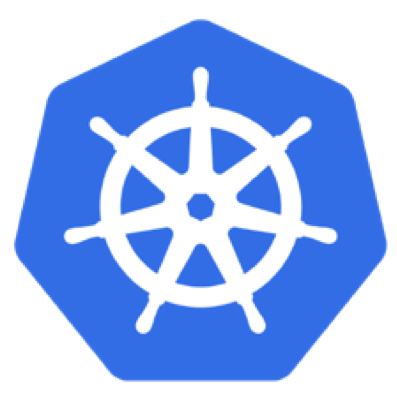
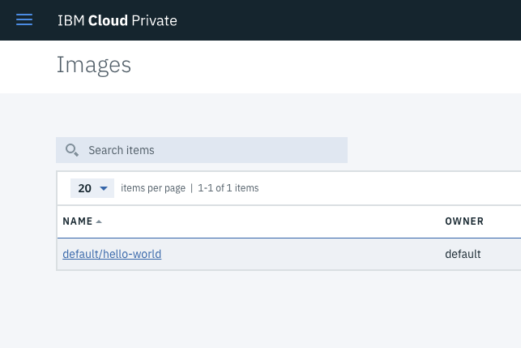
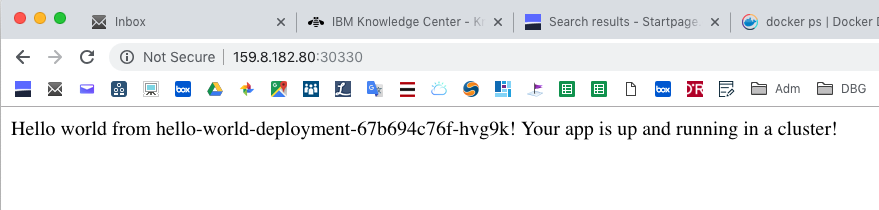
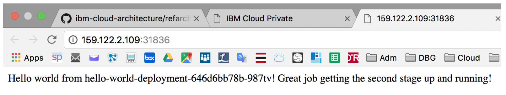
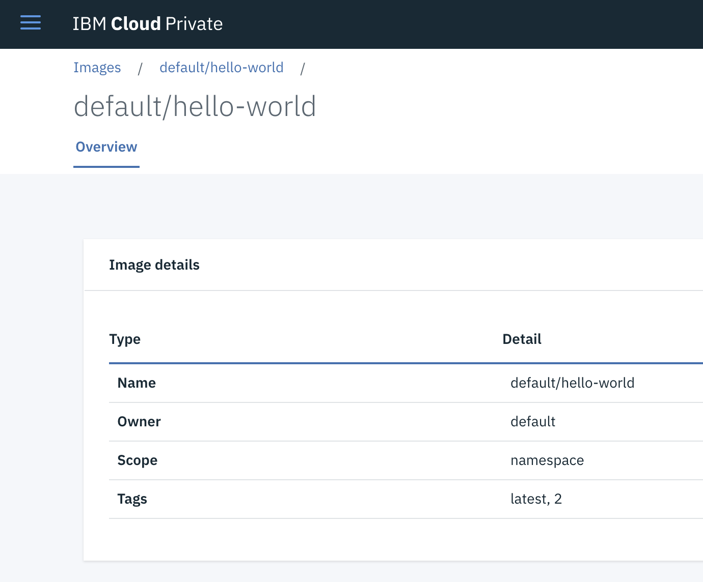

---
# Kubernetes Lab
---





# Task 1 : Deploying Apps with Kubernetes


### 1. Check kubectl 

Test your connectivity to the cluster with this command:

 `kubectl get nodes`

If you get an **error**, execute the following script that we created in the installation lab :

`~/connect2icp.sh`


### 2. Download a GIT repo

Download the samples using Git :

`cd`

`git clone https://github.com/IBM/container-service-getting-started-wt.git`
​	
Results:

```
# git clone https://github.com/IBM/container-service-getting-s
Cloning into 'container-service-getting-started-wt'...
remote: Enumerating objects: 8, done.
remote: Counting objects: 100% (8/8), done.
remote: Compressing objects: 100% (8/8), done.
remote: Total 880 (delta 1), reused 2 (delta 0), pack-reused 872
Receiving objects: 100% (880/880), 2.40 MiB | 5.19 MiB/s, done.
Resolving deltas: 100% (445/445), done.
```


### 4. Build a Docker image 

Build the image locally and tag it with the name that you want to use on the IBM Cloud Private kubernetes cluster. The tag includes the namespace name of `default` in the cluster. The tag also targets the master node of the cluster, which manages the job of placing it on one or more worker nodes. This is because of the alias you created in the previous step, with the cluster name linked to the master node name. The communications with the master node happen on port 8500. Tagging the image this way tells Docker where to push the image in a later step. Use lowercase alphanumeric characters or underscores only in the image name. Don't forget the period (.) at the end of the command. The period tells Docker to look inside the current directory for the Dockerfile and build artifacts to build the image.

`cd "container-service-getting-started-wt/Lab 1"`

`docker build -t mycluster.icp:8500/default/hello-world .`

Results:

```
# docker build -t mycluster.icp:8500/default/hello-world .
Sending build context to Docker daemon  15.36kB
Step 1/6 : FROM node:9.4.0-alpine
9.4.0-alpine: Pulling from library/node
605ce1bd3f31: Pull complete 
fe58b30348fe: Pull complete 
46ef8987ccbd: Pull complete 
Digest: sha256:9cd67a00ed111285460a83847720132204185e9321ec35dacec0d8b9bf674adf
Status: Downloaded newer image for node:9.4.0-alpine
 ---> b5f94997f35f
Step 2/6 : COPY app.js .
 ---> 58f4e5aad499
Step 3/6 : COPY package.json .
 ---> a5b3c912283a
Step 4/6 : RUN npm install &&    apk update &&    apk upgrade
 ---> Running in fb923b99b4d9
npm WARN deprecated connect@2.30.2: connect 2.x series is deprecated
npm WARN notice [SECURITY] debug has the following vulnerability: 1 low. Go here for more details: https://nodesecurity.io/advisories?search=debug&version=2.2.0 - Run `npm i npm@latest -g` to upgrade your npm version, and then `npm audit` to get more info.
npm WARN notice [SECURITY] mime has the following vulnerability: 1 moderate. Go here for more details: https://nodesecurity.io/advisories?search=mime&version=1.3.4 - Run `npm i npm@latest -g` to upgrade your npm version, and then `npm audit` to get more info.
npm WARN notice [SECURITY] base64-url has the following vulnerability: 1 high. Go here for more details: https://nodesecurity.io/advisories?search=base64-url&version=1.2.1 - Run `npm i npm@latest -g` to upgrade your npm version, and then `npm audit` to get more info.
npm WARN notice [SECURITY] fresh has the following vulnerability: 1 high. Go here for more details: https://nodesecurity.io/advisories?search=fresh&version=0.3.0 - Run `npm i npm@latest -g` to upgrade your npm version, and then `npm audit` to get more info.
npm WARN notice [SECURITY] negotiator has the following vulnerability: 1 high. Go here for more details: https://nodesecurity.io/advisories?search=negotiator&version=0.5.3 - Run `npm i npm@latest -g` to upgrade your npm version, and then `npm audit` to get more info.
npm notice created a lockfile as package-lock.json. You should commit this file.
npm WARN hello-world-demo@0.0.1 No repository field.
npm WARN hello-world-demo@0.0.1 No license field.

added 95 packages in 4.831s
fetch http://dl-cdn.alpinelinux.org/alpine/v3.6/main/x86_64/APKINDEX.tar.gz
fetch http://dl-cdn.alpinelinux.org/alpine/v3.6/community/x86_64/APKINDEX.tar.gz
v3.6.3-51-g77ebb2a927 [http://dl-cdn.alpinelinux.org/alpine/v3.6/main]
v3.6.3-50-g43dd52bda8 [http://dl-cdn.alpinelinux.org/alpine/v3.6/community]
OK: 8443 distinct packages available
Upgrading critical system libraries and apk-tools:
(1/1) Upgrading apk-tools (2.7.5-r0 -> 2.7.6-r0)
Executing busybox-1.26.2-r9.trigger
Continuing the upgrade transaction with new apk-tools:
(1/5) Upgrading busybox (1.26.2-r9 -> 1.26.2-r11)
Executing busybox-1.26.2-r11.post-upgrade
(2/5) Upgrading libressl2.5-libcrypto (2.5.5-r0 -> 2.5.5-r2)
(3/5) Upgrading libressl2.5-libssl (2.5.5-r0 -> 2.5.5-r2)
(4/5) Installing libressl2.5-libtls (2.5.5-r2)
(5/5) Installing ssl_client (1.26.2-r11)
Executing busybox-1.26.2-r11.trigger
OK: 5 MiB in 15 packages
Removing intermediate container fb923b99b4d9
 ---> ada60e87bc04
Step 5/6 : EXPOSE  8080
 ---> Running in e190095d85ac
Removing intermediate container e190095d85ac
 ---> fd6e8740d531
Step 6/6 : CMD node app.js
 ---> Running in 402a97019fb3
Removing intermediate container 402a97019fb3
 ---> 2f999802aed6
Successfully built 2f999802aed6
Successfully tagged mycluster.icp:8500/default/hello-world:latest
```

> Ignore the errors (red lines).

To see the image, use the command:

`docker images mycluster.icp:8500/default/hello-world:latest`

### 5. Push the image to the registry

Log in as user `admin` with password `admin1!`

`docker login mycluster.icp:8500`

`docker push mycluster.icp:8500/default/hello-world`

 Your output should look like this.

```
# docker push mycluster.icp:8500/default/hello-world
The push refers to repository [mycluster.icp:8500/default/hello-world]
96b6023918bd: Pushed 
df0c9d553dbf: Pushed 
d4db51a52ca0: Pushed 
0804854a4553: Pushed 
6bd4a62f5178: Pushed 
9dfa40a0da3b: Pushed 
latest: digest: sha256:019a5da27d6ed2a58fab45669707daf89932da7c2bc13072c41ed4fb372676af size: 1576
```


### 6. View your image in the console

Open a browser to https://ipaddress:8443. 

Change the ip address depending on you hosts file. Create a security exception in your browser for this location and if necessary, click on the `Advanced` link and follow the prompts. Log in as user `admin` with password `admin1!`

View your image using `Menu > Container Images`




### 7. Run your first deployment

Use your image to create a kubernetes deployment with the following command.

`kubectl run hello-world-deployment --image=mycluster.icp:8500/default/hello-world`

Results:

```
# kubectl run hello-world-deployment --image=mycluster.icp:8500/default/hello-world
deployment.apps/hello-world-deployment created
```


### 8. Expose your first service

Create a service to access your running container using the following command.

`kubectl expose deployment/hello-world-deployment --type=NodePort --port=8080 --name=hello-world-service --target-port=8080`

Your output should be:

```
# kubectl expose deployment/hello-world-deployment --type=NodePort --port=8080 --name=hello-world-service --target-port=8080
service/hello-world-service exposed
```


### 9. Identify the NodePort

With the NodePort type of service, the kubernetes cluster creates a 5-digit port number to access the running container on through the service. 

The service is accessed through the IP address of the proxy node on the NodePort port number. To discover the NodePort number that has been assigned, use the following command.

`kubectl describe service hello-world-service`

 Your output should look like this.

 ```
# kubectl describe service hello-world-service
Name:                     hello-world-service
Namespace:                default
Labels:                   run=hello-world-deployment
Annotations:              <none>
Selector:                 run=hello-world-deployment
Type:                     NodePort
IP:                       10.0.0.117
Port:                     <unset>  8080/TCP
TargetPort:               8080/TCP
NodePort:                 <unset>  30330/TCP
Endpoints:                10.1.193.133:8080
Session Affinity:         None
External Traffic Policy:  Cluster
Events:                   <none>

 ```

From that output, write down the nodePort (i.e. 30330 in that case).


### 10. Use the NodePort 

Open a web browser window and go to the URL of your master node with your NodePort number, such as `http://ipaddress:30330`. Your output should look like this.

 


### 11. Application troubleshooting 

You can view much of the information on your cluster resources visually through the IBM Cloud Private console, similar to information you might have viewed in the Kubernetes Dashboard. That is the subject of our next demo. As an alternative, you can obtain text-based information on all the resources running in your cluster using the following command.

`kubectl get pods`

Results:


    # kubectl get pods
    NAME                                      READY     STATUS    RESTARTS   AGE
    hello-world-deployment-67b694c76f-hvg9k   1/1       Running   0          11m

If the POD is running then look at the log (change the pod name with the one shown in latest command):

`kubectl logs hello-world-deployment-67b694c76f-hvg9k  `

Results:

```
# kubectl logs hello-world-deployment-67b694c76f-hvg9k
Sample app is listening on port 8080.

```

You can see the output of your nodeJS application.

You can also go inside your container:

`kubectl exec -it hello-world-deployment-67b694c76f-hvg9k /bin/sh`

Results:

```
# kubectl exec -it hello-world-deployment-67b694c76f-hvg9k /bin/sh
/ # ps
PID   USER     TIME   COMMAND
    1 root       0:00 /bin/sh -c node app.js
    7 root       0:00 node app.js
   19 root       0:00 /bin/sh
   25 root       0:00 ps
/ # 
/ # ls -l
total 96
-rw-r--r--    1 root     root           325 Nov 30 15:30 app.js
drwxr-xr-x    1 root     root          4096 Nov 30 15:31 bin
drwxr-xr-x    5 root     root           360 Nov 30 15:37 dev
drwxr-xr-x    1 root     root          4096 Nov 30 15:37 etc
drwxr-xr-x    1 root     root          4096 Jan 11  2018 home
drwxr-xr-x    1 root     root          4096 Nov 30 15:31 lib
drwxr-xr-x    5 root     root          4096 Jan  9  2018 media
drwxr-xr-x    2 root     root          4096 Jan  9  2018 mnt
drwxr-xr-x   80 root     root          4096 Nov 30 15:31 node_modules
drwxr-xr-x    3 root     root          4096 Jan 11  2018 opt
-rw-r--r--    1 root     root         25023 Nov 30 15:31 package-lock.json
-rw-r--r--    1 root     root           183 Nov 30 15:30 package.json
dr-xr-xr-x  583 root     root             0 Nov 30 15:37 proc
drwx------    1 root     root          4096 Nov 30 15:59 root
drwxr-xr-x    2 root     root          4096 Jan  9  2018 run
drwxr-xr-x    1 root     root          4096 Nov 30 15:31 sbin
drwxr-xr-x    2 root     root          4096 Jan  9  2018 srv
dr-xr-xr-x   13 root     root             0 Nov 30 15:03 sys
drwxrwxrwt    1 root     root          4096 Jan 11  2018 tmp
drwxr-xr-x    1 root     root          4096 Jan 11  2018 usr
drwxr-xr-x    1 root     root          4096 Jan  9  2018 var
/ # 

```

You can use some commands like: ps, ls, cat ...

Dont forget to **exit**

`# exit`


# Task 2 : Scaling Apps with Kubernetes

In this lab, understand how to update the number of replicas a deployment has and how to safely roll out an update on Kubernetes. Learn, also, how to perform a simple health check.

For this lab, you need a running deployment with a single replica. First, we cleaned up the running deployment.

### 1. Clean up the current deployment

To do so, use the 2 following commands :
- To remove the deployment, use:

`kubectl delete deployment hello-world-deployment`
- To remove the service, use: 

`kubectl delete service hello-world-service`

### 2. Run a clean deployment

To do so, use the following commands :

`kubectl run hello-world --image=mycluster.icp:8500/default/hello-world`

### 3. Scale the application

A replica is how Kubernetes accomplishes scaling out a deployment. A replica is a copy of a pod that already contains a running service. By having multiple replicas of a pod, you can ensure your deployment has the available resources to handle increasing load on your application.

kubectl provides a scale subcommand to change the size of an existing deployment. Let's us it to go from our single running instance to 10 instances.

`kubectl scale --replicas=10 deployment hello-world`

Here is the result:
```
$ kubectl scale --replicas=10 deployment hello-world
deployment "hello-world" scaled
```

Kubernetes will now act according to the desired state model to try and make true, the condition of 10 replicas. It will do this by starting new pods with the same configuration.

To see your changes being rolled out, you can run: 

`kubectl rollout status deployment/hello-world`

The rollout might occur so quickly that the following messages might not display:

```console
$ kubectl rollout status deployment/hello-world
Waiting for rollout to finish: 1 of 10 updated replicas are available...
Waiting for rollout to finish: 2 of 10 updated replicas are available...
Waiting for rollout to finish: 3 of 10 updated replicas are available...
Waiting for rollout to finish: 4 of 10 updated replicas are available...
Waiting for rollout to finish: 5 of 10 updated replicas are available...
Waiting for rollout to finish: 6 of 10 updated replicas are available...
Waiting for rollout to finish: 7 of 10 updated replicas are available...
Waiting for rollout to finish: 8 of 10 updated replicas are available...
Waiting for rollout to finish: 9 of 10 updated replicas are available...
deployment "hello-world" successfully rolled out
```

Once the rollout has finished, ensure your pods are running by using: kubectl get pods.
You should see output listing 10 replicas of your deployment:
`kubectl get pods`

Here is the result:

```console
NAME                          READY     STATUS    RESTARTS   AGE
hello-world-562211614-1tqm7   1/1       Running   0          1d
hello-world-562211614-1zqn4   1/1       Running   0          2m
hello-world-562211614-5htdz   1/1       Running   0          2m
hello-world-562211614-6h04h   1/1       Running   0          2m
hello-world-562211614-ds9hb   1/1       Running   0          2m
hello-world-562211614-nb5qp   1/1       Running   0          2m
hello-world-562211614-vtfp2   1/1       Running   0          2m
hello-world-562211614-vz5qw   1/1       Running   0          2m
hello-world-562211614-zksw3   1/1       Running   0          2m
hello-world-562211614-zsp0j   1/1       Running   0          2m
```

### 4. Rollout an update to  the application

Kubernetes allows you to use a rollout to update an app deployment with a new Docker image. This allows you to easily update the running image and also allows you to easily undo a rollout, if a problem is discovered after deployment.

In the previous lab, we created an image with a 1 tag. Let's make a version of the image that includes new content and use a 2 tag. This lab also contains a Dockerfile. Let's build and push it up to our image registry.

If you are in "Lab 1" directory, you need to go to "Lab 2" directory:

`cd ../"Lab 2"`

Build a new version (2) of that application: 

`docker build --tag mycluster.icp:8500/default/hello-world:2 .`

Then push the new version into the registry:

`docker push mycluster.icp:8500/default/hello-world:2`

Using kubectl, you can now update your deployment to use the latest image. kubectl allows you to change details about existing resources with the set subcommand. We can use it to change the image being used.

`kubectl set image deployment/hello-world hello-world=mycluster.icp:8500/default/hello-world:2`

Note that a pod could have multiple containers, in which case each container will have its own name. Multiple containers can be updated at the same time. 

Run kubectl rollout status deployment/hello-world or kubectl get replicasets to check the status of the rollout. The rollout might occur so quickly that the following messages might not display:

`kubectl rollout status deployment/hello-world`

Results:

```console
# kubectl rollout status deployment/hello-world
Waiting for rollout to finish: 2 out of 10 new replicas have been updated...
Waiting for rollout to finish: 3 out of 10 new replicas have been updated...
Waiting for rollout to finish: 3 out of 10 new replicas have been updated...
Waiting for rollout to finish: 3 out of 10 new replicas have been updated...
Waiting for rollout to finish: 4 out of 10 new replicas have been updated...
Waiting for rollout to finish: 4 out of 10 new replicas have been updated...
Waiting for rollout to finish: 4 out of 10 new replicas have been updated...
Waiting for rollout to finish: 4 out of 10 new replicas have been updated...
Waiting for rollout to finish: 4 out of 10 new replicas have been updated...
Waiting for rollout to finish: 5 out of 10 new replicas have been updated...
Waiting for rollout to finish: 5 out of 10 new replicas have been updated...
Waiting for rollout to finish: 5 out of 10 new replicas have been updated...
Waiting for rollout to finish: 6 out of 10 new replicas have been updated...
Waiting for rollout to finish: 6 out of 10 new replicas have been updated...
Waiting for rollout to finish: 6 out of 10 new replicas have been updated...
Waiting for rollout to finish: 7 out of 10 new replicas have been updated...
Waiting for rollout to finish: 7 out of 10 new replicas have been updated...
Waiting for rollout to finish: 7 out of 10 new replicas have been updated...
Waiting for rollout to finish: 7 out of 10 new replicas have been updated...
Waiting for rollout to finish: 8 out of 10 new replicas have been updated...
Waiting for rollout to finish: 8 out of 10 new replicas have been updated...
Waiting for rollout to finish: 8 out of 10 new replicas have been updated...
Waiting for rollout to finish: 8 out of 10 new replicas have been updated...
Waiting for rollout to finish: 9 out of 10 new replicas have been updated...
Waiting for rollout to finish: 9 out of 10 new replicas have been updated...
Waiting for rollout to finish: 9 out of 10 new replicas have been updated...
Waiting for rollout to finish: 1 old replicas are pending termination...
Waiting for rollout to finish: 1 old replicas are pending termination...
Waiting for rollout to finish: 1 old replicas are pending termination...
Waiting for rollout to finish: 9 of 10 updated replicas are available...
Waiting for rollout to finish: 9 of 10 updated replicas are available...
Waiting for rollout to finish: 9 of 10 updated replicas are available...
deployment "hello-world" successfully rolled out
```

Finally, use that command to see the result:

`kubectl get replicasets`

```
=> kubectl get replicasets
NAME                   DESIRED   CURRENT   READY     AGE
hello-world-1663871401   0         0         0         1h
hello-world-3254495675   10        10        10        1m
```

Create a new service:

`kubectl expose deployment/hello-world --type=NodePort --port=8080 --name=hello-world-service --target-port=8080`

Take a note of the NodePort in the description. The NodePord is working against the public IP address of the worker node (in this case this is our unique **ipaddress**)

Perform a curl `http://ipaddress:<nodeport>` to confirm your new code is active or open a browser and you see "Great Job for the second stage".



# Task 3: Understand Kubernetes manifests


### 1. Build a new Docker image

Move to the Lab 2 directory:

`cd "/root/container-service-getting-started-wt/Lab 2"`


Then build the container:		

`docker build -t mycluster.icp:8500/default/hello-world:2 .`

Results:

```
# docker build -t mycluster.icp:8500/default/hello-world:2 .
Sending build context to Docker daemon  19.97kB
Step 1/6 : FROM node:9.4.0-alpine
 ---> b5f94997f35f
Step 2/6 : COPY app.js .
 ---> c467af3982b0
Step 3/6 : COPY package.json .
 ---> 11ff09137cdd
Step 4/6 : RUN npm install &&    apk update &&    apk upgrade
 ---> Running in 93f16cde853c
npm WARN deprecated connect@2.30.2: connect 2.x series is deprecated
npm WARN notice [SECURITY] debug has the following vulnerability: 1 low. Go here for more details: https://nodesecurity.io/advisories?search=debug&version=2.2.0 - Run `npm i npm@latest -g` to upgrade your npm version, and then `npm audit` to get more info.
npm WARN notice [SECURITY] mime has the following vulnerability: 1 moderate. Go here for more details: https://nodesecurity.io/advisories?search=mime&version=1.3.4 - Run `npm i npm@latest -g` to upgrade your npm version, and then `npm audit` to get more info.
npm WARN notice [SECURITY] base64-url has the following vulnerability: 1 high. Go here for more details: https://nodesecurity.io/advisories?search=base64-url&version=1.2.1 - Run `npm i npm@latest -g` to upgrade your npm version, and then `npm audit` to get more info.
npm WARN notice [SECURITY] fresh has the following vulnerability: 1 high. Go here for more details: https://nodesecurity.io/advisories?search=fresh&version=0.3.0 - Run `npm i npm@latest -g` to upgrade your npm version, and then `npm audit` to get more info.
npm WARN notice [SECURITY] negotiator has the following vulnerability: 1 high. Go here for more details: https://nodesecurity.io/advisories?search=negotiator&version=0.5.3 - Run `npm i npm@latest -g` to upgrade your npm version, and then `npm audit` to get more info.
npm notice created a lockfile as package-lock.json. You should commit this file.
npm WARN hello-world-armada@0.0.1 No repository field.
npm WARN hello-world-armada@0.0.1 No license field.

added 95 packages in 4.372s
fetch http://dl-cdn.alpinelinux.org/alpine/v3.6/main/x86_64/APKINDEX.tar.gz
fetch http://dl-cdn.alpinelinux.org/alpine/v3.6/community/x86_64/APKINDEX.tar.gz
v3.6.3-51-g77ebb2a927 [http://dl-cdn.alpinelinux.org/alpine/v3.6/main]
v3.6.3-50-g43dd52bda8 [http://dl-cdn.alpinelinux.org/alpine/v3.6/community]
OK: 8443 distinct packages available
Upgrading critical system libraries and apk-tools:
(1/1) Upgrading apk-tools (2.7.5-r0 -> 2.7.6-r0)
Executing busybox-1.26.2-r9.trigger
Continuing the upgrade transaction with new apk-tools:
(1/5) Upgrading busybox (1.26.2-r9 -> 1.26.2-r11)
Executing busybox-1.26.2-r11.post-upgrade
(2/5) Upgrading libressl2.5-libcrypto (2.5.5-r0 -> 2.5.5-r2)
(3/5) Upgrading libressl2.5-libssl (2.5.5-r0 -> 2.5.5-r2)
(4/5) Installing libressl2.5-libtls (2.5.5-r2)
(5/5) Installing ssl_client (1.26.2-r11)
Executing busybox-1.26.2-r11.trigger
OK: 5 MiB in 15 packages
Removing intermediate container 93f16cde853c
 ---> e7fcd8830cb8
Step 5/6 : EXPOSE  8080
 ---> Running in d2db3b012dd2
Removing intermediate container d2db3b012dd2
 ---> 53a223a238bf
Step 6/6 : CMD node app.js
 ---> Running in bac33012193b
Removing intermediate container bac33012193b
 ---> 7d82259c0fdd
Successfully built 7d82259c0fdd
```

Then ckeck the image has been built:

`docker images mycluster.icp:8500/default/hello-world`

And finally push the image to the ICP registry:

`docker push mycluster.icp:8500/default/hello-world:2`

Result:

```
# docker push mycluster.icp:8500/default/hello-world:2
The push refers to repository [mycluster.icp:8500/default/hello-world]
0a7c2f714c9d: Pushed 
8a3495226438: Pushed 
14292fae6c1a: Pushed 
0804854a4553: Layer already exists 
6bd4a62f5178: Layer already exists 
9dfa40a0da3b: Layer already exists 
2: digest: sha256:e91a9c066b54cfb657c3d0721441a38bf8719cdbd0eecc94e8637ebf175331c1 size: 1576
```


### 2. View the image in the registry

Type https://ipaddress:8443

	- Select **Menu > Container Images**
	- Click on the `default/hello-world`
	- Check version 2 and Latest are in the Tags



### 3. Analyse a Kubernetes manifest

Open the **healthcheck.yml** file

`nano healthcheck.yml`

- the symbol `---` indicates a delimiter for a new resource
- Note that there are 2 resources being deployed here, a **deployment** and a **service**.
- The metadata section defines the attributes of the resource (name, annotation, label etc), while the spec specifies the detail of the resource

Review the deployment's manifest

```
apiVersion: apps/v1beta1
kind: Deployment
metadata:
  name: hw-demo-deployment
spec:
  replicas: 3
  template:
    metadata:
      name: pod-liveness-http
      labels:
        run: hw-demo-health
        test: hello-world-demo
    spec:
      containers:
        - name: hw-demo-container
          image: "registry.ng.bluemix.net/<namespace>/hello-world:2"
          imagePullPolicy: Always
          livenessProbe:
            httpGet:
              path: /healthz
              port: 8080
            initialDelaySeconds: 5
            periodSeconds: 5
---
```

- Look into the deployment and see that the **spec** contains a ReplicaSet (see the `replicas` term) and that the ReplicaSet includes a Pod
- The Pod is defined as a template that contains the similar structure of metadata and specification
- The specification of the pod includes an array of containers that refers to an image.
- The livenessProbe and readinessProbe are checks that the kubernetes system would perform to check pod's health.

Review the **service's manifest**

```
---
apiVersion: v1
kind: Service
metadata:
  name: hw-demo-service
  labels:
    run: hw-demo-health
spec:
  type: NodePort
  selector:
    run: hw-demo-health
  ports:
   - protocol: TCP
     port: 8080
     nodePort: 30072
```

- The service defines the accessibility of a pod. This service is of type NodePort, which exposes an internal Port (8080) into an externally accessible nodePort through the proxy node (here port 30072)
- How does a service know which pod are associated with it?  From the selector(s) that would select all pods with the same label(s) to be load balanced.

### 4. Check the health of apps

Kubernetes uses availability checks (**liveness probes**) to know when to restart a container. For example, liveness probes could catch a deadlock, where an application is running, but unable to make progress. Restarting a container in such a state can help to make the application more available despite bugs.

Also, Kubernetes uses readiness checks to know when a container is ready to start accepting traffic. A pod is considered ready when all of its containers are ready. One use of this check is to control which pods are used as backends for services. When a pod is not ready, it is removed from load balancers.

In this example, we have defined a HTTP liveness probe to check health of the container every five seconds. For the first 60 seconds, the /healthz returns a 200 response and will fail afterward. Kubernetes will automatically restart the service.

Open the **healthcheck.yml** file with a text editor. 

`nano healthcheck.yml`

This configuration script combines a few steps from the previous lesson to create a deployment and a service at the same time. App developers can use these scripts when updates are made or to troubleshoot issues by re-creating the pods:

Update the details for the image in your private registry namespace:

`image: "mycluster.icp:8500/default/hello-world:2"`

> Don't use any tab when changing that line

> Note the HTTP liveness probe that checks the health of the container every five seconds.

```
livenessProbe:
            httpGet:
              path: /healthz
              port: 8080
            initialDelaySeconds: 5
            periodSeconds: 5
```

In the Service section, note the NodePort. Rather than generating a random NodePort like you did in the previous lesson, you can specify a port in the 30000 - 32767 range. This example uses 30072.

Run the configuration script in the cluster. When the deployment and the service are created, the app is available for anyone to see:

`kubectl apply -f healthcheck.yml`

Now that all the deployment work is done, check how everything turned out. You might notice that because more instances are running, things might run a bit slower.

Open a browser and check out the app. To form the URL, combine the IP with the NodePort that was specified in the configuration script. 

In a browser, you'll see a success message. If you do not see this text, don't worry. This app is designed to go up and down.

For the first minute, a 200 message is returned, so you know that the app is running successfully. After those 60 seconds or so, a timeout message is displayed, as is designed in the app.

Launch your ICP dashboard:

In the Workloads tab, you can see the resources that you created. From this tab, you can continually refresh and see that the health check is working. In the Pods section, you can see how many times the pods are restarted when the containers in them are re-created. You might happen to catch errors in the dashboard, indicating that the health check caught a problem. Give it a few minutes and refresh again. You see the number of restarts changes for each pod.

Ready to delete what you created before you continue? This time, you can use the same configuration script to delete both of the resources you created.

`kubectl delete -f healthcheck.yml`

When you are done exploring the Kubernetes dashboard, in your CLI, enter CTRL+C to exit the proxy command.

# Conclusion

Congratulations, you have successfully completed this Kubernetes lab ! 

---

