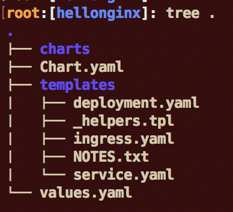
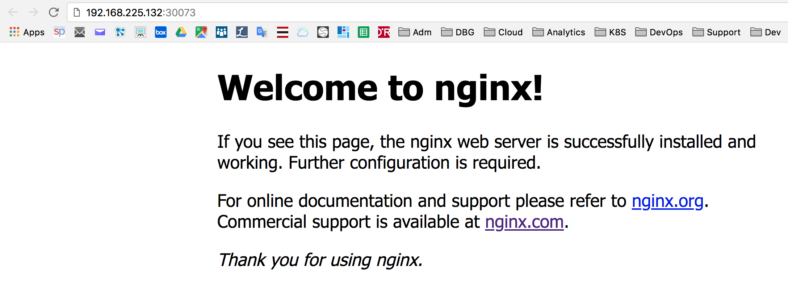

---
# Helm Lab
---


# Task 1 : Define a Helm chart

Now that you have understood the structure of a kubernetes manifest file, you can start working with helm chart. Basically a helm chart is a collection of manifest files that are deployed as a group. The deployment includes the ability to perform variable substitution based on a configuration file.

### 1. Check Helm

`helm version —tls`

Results:

```console 
# helm version --tls
Client: &version.Version{SemVer:"v2.9.1", GitCommit:"20adb27c7c5868466912eebdf6664e7390ebe710", GitTreeState:"clean"}
Server: &version.Version{SemVer:"v2.9.1+icp", GitCommit:"843201eceab24e7102ebb87cb00d82bc973d84a7", GitTreeState:"clean"}

```

> If you don't see the client and servers numbers or an error, then go back to the installation lab.
>
> Also check the lubernetes connection `./connect2icp.sh`


### 2. Create an empty chart directory

`cd`

`helm create hellonginx`

`cd hellonginx`

`apt install tree`

`tree .`





Edit the value.yaml file:

`nano values.yaml`

Look at **values.yaml** and **modify it**. 

`nano values.yaml`

Replace the **service section** and choose a port (like 30073 for instance) with the following code:

```console
 service:
  name: hellonginx-service
  type: NodePort
  externalPort: 80
  internalPort: 80
  nodePort: 30073
```

The main content for **values.yaml** is as follows:

```
# Default values for hellonginx.
# This is a YAML-formatted file.
# Declare variables to be passed into your templates.

replicaCount: 1

image:
  repository: nginx
  tag: stable
  pullPolicy: IfNotPresent

service:
  name: hellonginx-service
  type: NodePort
  externalPort: 80  
  internalPort: 80  
  nodePort: 30073

ingress:
  enabled: false
  annotations: {}
    # kubernetes.io/ingress.class: nginx
    # kubernetes.io/tls-acme: "true"
  path: /
  hosts:
    - chart-example.local
  tls: []
  #  - secretName: chart-example-tls
  #    hosts:
  #      - chart-example.local

resources: {}
  # We usually recommend not to specify default resources and to leave this as a conscious
  # choice for the user. This also increases chances charts run on environments with little
  # resources, such as Minikube. If you do want to specify resources, uncomment the following
  # lines, adjust them as necessary, and remove the curly braces after 'resources:'.
  # limits:
  #  cpu: 100m
  #  memory: 128Mi
  # requests:
  #  cpu: 100m
  #  memory: 128Mi

nodeSelector: {}

tolerations: []

affinity: {}
```


Review deployment template:

`nano /root/hellonginx/templates/deployment.yaml`

**Don't change anything.**

```
apiVersion: apps/v1beta2
kind: Deployment
metadata:
  name: {{ template "hellonginx.fullname" . }}
  labels:
    app: {{ template "hellonginx.name" . }}
    chart: {{ template "hellonginx.chart" . }}
    release: {{ .Release.Name }}
    heritage: {{ .Release.Service }}
spec:
  replicas: {{ .Values.replicaCount }}
  selector:
    matchLabels:
      app: {{ template "hellonginx.name" . }}
      release: {{ .Release.Name }}
  template:
    metadata:
      labels:
        app: {{ template "hellonginx.name" . }}
        release: {{ .Release.Name }}
    spec:
      containers:
        - name: {{ .Chart.Name }}
          image: "{{ .Values.image.repository }}:{{ .Values.image.tag }}"
          imagePullPolicy: {{ .Values.image.pullPolicy }}
          ports:
            - name: http
              containerPort: 80
              protocol: TCP
          livenessProbe:
            httpGet:
              path: /
              port: http
          readinessProbe:
            httpGet:
              path: /
              port: http
          resources:
{{ toYaml .Values.resources | indent 12 }}
    {{- with .Values.nodeSelector }}
      nodeSelector:
{{ toYaml . | indent 8 }}
    {{- end }}
    {{- with .Values.affinity }}
      affinity:
{{ toYaml . | indent 8 }}
    {{- end }}
    {{- with .Values.tolerations }}
      tolerations:
{{ toYaml . | indent 8 }}
    {{- end }}
```

Then review the **service template**:
`nano /root/hellonginx/templates/service.yaml`

Change the **-port section** with the following code (don't introduce any TAB in the file):

        - port: {{ .Values.service.externalPort }}
          targetPort: {{ .Values.service.internalPort }}
          protocol: TCP
          nodePort: {{ .Values.service.nodePort }}
          name: {{ .Values.service.name }}
So the service should look as follows:

```
apiVersion: v1
kind: Service
metadata:
  name: {{ template "hellonginx.fullname" . }}
  labels:
    app: {{ template "hellonginx.name" . }}
    chart: {{ template "hellonginx.chart" . }}
    release: {{ .Release.Name }}
    heritage: {{ .Release.Service }}
spec:
  type: {{ .Values.service.type }}
  ports:
    - port: {{ .Values.service.externalPort }}
      targetPort: {{ .Values.service.internalPort }}
      protocol: TCP
      nodePort: {{ .Values.service.nodePort }}
      name: {{ .Values.service.name }}
  selector:
    app: {{ template "hellonginx.name" . }}
    release: {{ .Release.Name }}
```

### 3. Check the chart

Go back to the hellonginx path and check the validity of the helm chart.

`cd /root/hellonginx`

`helm lint`


In case of error, you can :

- Analyse your change
- Check you didn't introduce any tab or cyrillic characters in the YAML files
- Check the parenthesis in the files


# Task 2 : Using Helm

The helm chart that we created in the previous section that has been verified now can be deployed.

### 1. Create a new namespace

You can use the command line to create a new namespace or you can use the IBM Cloud Private Console to do so:
- Open a  Web browser from the application launcher
- Go to `https://mycluster.icp:8443/`
- Login as `admin` with the password of `admin`
- Go to **Menu > Manage**

- Select __Namespaces__ then click __New namespace__


  - Specify the namespace of `training` and click __Add namespace__
    


### 2. Install the chart to the training namespace

Type the following command and don't forget the dot at the end:

`helm install --name hellonginx --namespace training --tls .`

Results:
```console
# helm install --name hellonginx --namespace training --tls .
NAME:   hellonginx
LAST DEPLOYED: Thu Apr 19 23:49:47 2018
NAMESPACE: training
STATUS: DEPLOYED

RESOURCES:
==> v1beta2/Deployment
NAME        DESIRED  CURRENT  UP-TO-DATE  AVAILABLE  AGE
hellonginx  1        1        1           0          0s

==> v1/Service
NAME        TYPE      CLUSTER-IP  EXTERNAL-IP  PORT(S)       AGE
hellonginx  NodePort  10.0.0.131  <none>       80:30073/TCP  0s


NOTES:
1. Get the application URL by running these commands:
  export NODE_PORT=$(kubectl get --namespace training -o jsonpath="{.spec.ports[0].nodePort}" services hellonginx)
  export NODE_IP=$(kubectl get nodes --namespace training -o jsonpath="{.items[0].status.addresses[0].address}")
  echo http://$NODE_IP:$NODE_PORT
```


As you can see, we installed 2 Kubernetes resources : a deployment and a service.

Check the pods are running in the training namespace:

`kubectl get pods -n training`

Results:

```
# kubectl get pods -n training
NAME                          READY     STATUS    RESTARTS   AGE
hellonginx-798f6d7885-vqdv4   1/1       Running   0          5m
```

You should use the following  url:
`http://ipaddress:30073`

Try this url and get the nginx hello:




### 3. List the releases

` helm list hellonginx --tls --namespace training`

Results:

```console
# helm list hellonginx --tls --namespace training
NAME      	REVISION	UPDATED                 	STATUS  	CHART           	NAMESPACE
hellonginx	1       	Mon Oct  8 20:54:37 2018	DEPLOYED	hellonginx-0.1.0	training 
```


### 4. List the deployments

`kubectl get deployments --namespace=training`

```console
# kubectl get deployments --namespace=training
NAME         DESIRED   CURRENT   UP-TO-DATE   AVAILABLE   AGE
hellonginx   1         1         1            1           9m
```

### 5. List the services

`kubectl get services --namespace=training`

```console
# kubectl get services --namespace=training
NAME         TYPE       CLUSTER-IP   EXTERNAL-IP   PORT(S)        AGE
hellonginx   NodePort   10.0.0.131   <none>        80:30073/TCP   10m
```

Locate the line port 80:300073.  

### 6. List the pods

`kubectl get pods --namespace=training`

**Results**

```console
root:[hellonginx]: kubectl get pods --namespace=training
NAME                          READY     STATUS    RESTARTS   AGE
hellonginx-6bcd9f4578-zqt6r   1/1       Running   0          11m
```

### 7. Upgrade

We now want to change the number of replicas to **3** (change the **replicaCount** variable in the **values.yaml** file:

`nano values.yaml`

Change the replicas to 3 and then upgrade hellonginx:

`helm  upgrade hellonginx . --tls`

**Results**

```console
root:[hellonginx]: helm  upgrade hellonginx . --tls
Release "hellonginx" has been upgraded. Happy Helming!
LAST DEPLOYED: Fri Apr 20 00:06:55 2018
NAMESPACE: training
STATUS: DEPLOYED

RESOURCES:
==> v1/Service
NAME        TYPE      CLUSTER-IP  EXTERNAL-IP  PORT(S)       AGE
hellonginx  NodePort  10.0.0.131  <none>       80:30073/TCP  17m

==> v1beta2/Deployment
NAME        DESIRED  CURRENT  UP-TO-DATE  AVAILABLE  AGE
hellonginx  3        3        3           1          17m


NOTES:
1. Get the application URL by running these commands:
  export NODE_PORT=$(kubectl get --namespace training -o jsonpath="{.spec.ports[0].nodePort}" services hellonginx)
  export NODE_IP=$(kubectl get nodes --namespace training -o jsonpath="{.items[0].status.addresses[0].address}")
  echo http://$NODE_IP:$NODE_PORT
```

### 8. Define the chart in the ICP Catalog

A good idea is to define the chart in the catalog.

First, package the helm chart as a tgz file:

`cd`

`helm package hellonginx`

Results:

```
# helm package hellonginx
Successfully packaged chart and saved it to: /root/hellonginx-0.1.0.tgz
```

**Login** to the master:
`cloudctl login -a https://mycluster.icp:8443 --skip-ssl-validation`

Then, use the **cloudctl catalog**command to load the chart:
`cloudctl catalog load-helm-chart --archive /root/hellonginx-0.1.0.tgz`

Results:

``` 
# cloudctl catalog load-helm-chart --archive /root/hellonginx-0.1.0.tgz
Loading helm chart
Loaded helm chart

Synch charts
Synch started
OK
```


Leave the terminal and login to the ICP console with admin/admin :

- Select **Catalog** on the top right side of the ICP console

- Find the `hellonginx` chart from AppCenter


- Click on the `hellonginx` chart to get access to configuration.


- Click configure to see the parameters:


Click on Parameters at the bottom of the first page. 
Find and change the **release name**, the **namspace** and the **nodeport** (for example 30075)

Click **Install** to see the results.

Then check the application is running with `http://ipaddress:nodeport`in your browser.

Of course, you can customize the README.MD and add an icon to make the chart more appealing.


# Conclusion

You successfully created and managed charts to deploy applications on the IBM Cloud Private.

---

